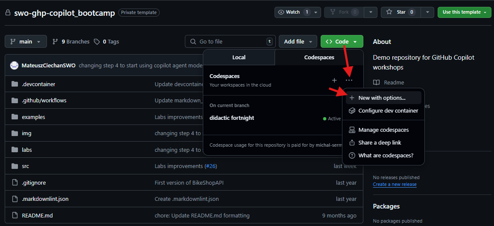
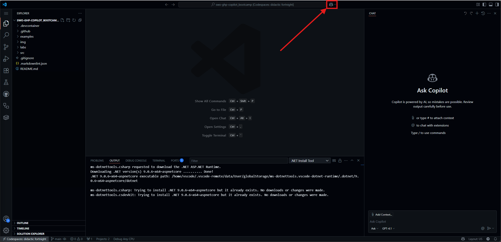
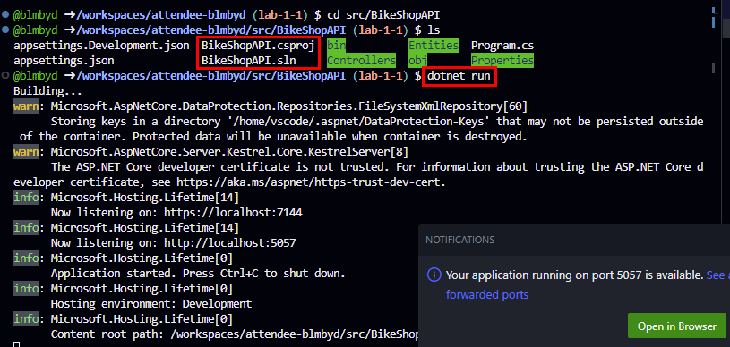
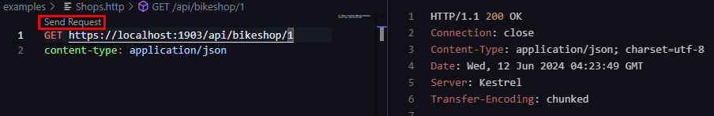

# Lab 0 - Prerrequisitos: Configuración de GitHub CodeSpaces y tu repositorio

En este Taller Práctico, descubrirás cómo usar tu repositorio personal de GitHub con Codespaces para estos talleres prácticos.

## Tiempo Requerido

- 10 minutos

## Objetivos

- Explorar GitHub Codespaces
- Configurar un Codespace para tu repositorio con extensiones y configuraciones específicas.
  Luego podrás utilizar este Codespace para trabajar en los ejercicios de los talleres prácticos.

### Paso 1: Entendiendo Codespaces

GitHub Codespaces es una funcionalidad que te permite programar directamente en el navegador. Es un entorno de desarrollo alojado en la nube al que puedes acceder desde cualquier ubicación. Es un entorno de desarrollo completamente equipado que puede usarse para desarrollar, construir y depurar tus aplicaciones. Está basado en Visual Studio Code, por lo que obtienes todas las características de Visual Studio Code, incluyendo extensiones, IntelliSense y depuración.

- GitHub aloja cada Codespace en un contenedor Docker en una máquina virtual, con opciones que van desde 2 hasta 32 núcleos, 8 a 64 GB de RAM y 32 a 128 GB de almacenamiento. Codespaces utiliza por defecto una imagen de Ubuntu Linux con lenguajes y herramientas comunes, pero puedes personalizarla con cualquier distribución de Linux para satisfacer tus necesidades específicas.

### Paso 2: Generar un Codespace en tu repositorio

- Inicialmente, vamos a generar un Codespace básico que utilizarás durante este bootcamp.

Navega a tu repositorio personal en la URL <https://github.com/[nombre-de-esta-org]/attendee-[tuusuario]>.

- Localiza la pestaña `Code` cerca del menú superior.
- Haz clic en el botón verde `Code`, luego haz clic en `Codespaces`, haz clic en los 3 puntos suspensivos "..." y elige `"New with options"` (Nuevo con opciones).

- Mantén los valores predeterminados y haz clic en `Create Codespace` (Crear Codespace).



Tu Codespace se está creando. Después de unos minutos, podrás ver tu Codespace en el navegador.

### Paso 3: Confirmar Funcionalidad

#### Confirmar Funcionalidad de Copilot

- Haz clic en el ícono de GitHub Copilot en la parte superior de la barra de herramientas de tu ventana de Codespaces.



- Escribe `Hello` y presiona `Enter` para interactuar con Copilot.

## Pasos de Confirmación Opcionales

### Confirmar que la aplicación funciona

- Inicia la aplicación y verifica que esté ejecutándose.
- Desde la ventana de terminal, navega a la carpeta de la aplicación: `cd ./src/BikeShopAPI/`
- Ejecuta la aplicación escribiendo el siguiente comando en el terminal:

  ```sh
  dotnet run
  ```

Si encuentras un mensaje de error como `Project file does not exist.` o `Couldn't find a project to run.`, es probable que estés ejecutando el comando desde un directorio incorrecto. Para resolver esto, navega al directorio correcto usando el comando `cd ./src/BikeShopAPI`. Si necesitas subir un nivel en la estructura de directorios, usa el comando `cd ..`. El directorio correcto es el que contiene el archivo `BikeShopAPI.csproj`.

Si encuentras un mensaje de error como `Unable to configure HTTPS endpoint. No server certificate was specified...`, necesitas generar un certificado de desarrollador. Para hacer esto, ejecuta `dotnet dev-certs https` en el terminal.



### Verificar la llamada a la API REST

#### Extensión Rest Client

La extensión de cliente API REST es una herramienta valiosa para ejecutar solicitudes HTTP dentro de tu IDE y mantenerlas bajo control de versiones.

Para usar la extensión, sigue estos pasos:

1. Abre el archivo `Examples/Shops.http`.
2. Haz clic en el botón "Send Request" para ejecutar la solicitud.

   ```http
   GET https://localhost:1903/api/bikeshop/1
   content-type: application/json
   ```

   

3. Recibirás una respuesta `200 OK`, indicando que el vuelo ha despegado.

   La respuesta será:

   ```http
   HTTP/1.1 200 OK
   Connection: close
   ```

4. Para detener la aplicación, presiona `Ctrl+C` en la ventana del terminal.

### Verificar las pruebas unitarias

Para verificar las pruebas unitarias, sigue estos pasos:

1. Abre la ventana del terminal.
2. Ve a la carpeta `src/BikeShopAPI.Test` (usando el comando `cd`).
3. Ejecuta el comando `ls` en el terminal. Deberías ver el archivo `BikeShopAPI.Test.csproj` en la salida.
4. Ejecuta las pruebas unitarias existentes ejecutando el comando `dotnet test` en el terminal.

   Las pruebas deberían ejecutarse y pasar. Verás una salida similar a esta:

   ```text
   Starting test execution, please wait...
   A total of 1 test files matched the specified pattern.
   Passed!  - Failed:  0, Passed:  3, Skipped:  0, Total:  3
   ```
