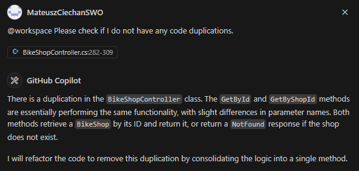
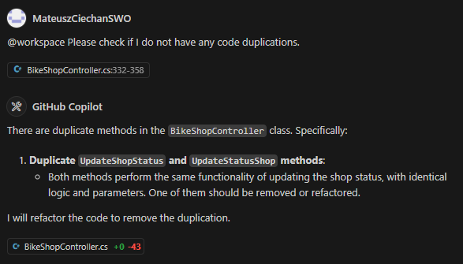

# Lab 1 - Basic Coding with Copilot

This module showcases the usage of GitHub Copilot's Chat Extension and its chat participants (@workspace, @terminal, @vscode) for understanding and navigating a codebase, implementing REST API methods, generating code from comments, and maintaining coding style consistency. It aims to provide a comprehensive, productivity-enhancing coding experience.

> [!IMPORTANT]
> While GitHub Copilot is a powerful tool, it’s not infallible. The responses it generates can sometimes be incorrect or not exactly what you intended. This is part of the challenge and learning experience. During the workshop, we encourage you to experiment with modifying your prompts to guide GitHub Copilot towards generating the correct code.

## Time Required

- 30 minutes

## Goals

- Introduction to GitHub Copilot Chat and its chat participants for code completion and style adaptation.

Please note that Copilot's responses are generated based on a mix of curated data, algorithms, and machine learning models. As a result, they may not always be accurate or reflect the most current information available. It is advised to verify Copilot's outputs with trusted sources before making decisions based on them.

### Step 1: Explain the Codebase with GitHub Copilot Chat

- Open GitHub Copilot Chat in the **Ask** mode.

- Type the following in the chat window to compare the difference between asking with and without @workspace:

1. Without @workspace:

   ```text
   explain the BikeShop API
   ```

2. With @workspace:

   ```text
   @workspace explain the BikeShop API
   ```

- Copilot will provide a brief overview of the API, which can be helpful for getting a quick understanding of the codebase.

GitHub Copilot Chat includes several **chat participants** —such as `@workspace`, `@terminal`, `@vscode`, and `@github`— each with a specific area of expertise to help you work more effectively in your development environment. To interact with a specific participant, type `@` followed by the participant’s name in the chat prompt box. To see all available participants, type `@` in the chat prompt box.

- Try the `@terminal` chat participant by typing the following in the chat window:

  ```text
  @terminal how to run dotnet application?
  ```

- Copilot will suggest a way to run the application in the terminal.

- Try the `@vscode` chat participant by typing the following in the chat window:

  ```text
  @vscode how to install extensions?
  ```

- Copilot will provide instructions or an action button to install extensions.

The `@workspace` command may not always provide the correct answer and may even make things up. This is a known issue that will be improved in the future. However, it does give a good idea of what is possible.

When asking follow-up questions, the chat participants needs to be provided again. For example, if you ask `@workspace` a question and then ask another question, you need to type `@workspace` again.

The `@workspace` chat participant analyzes each file briefly based on the opened Workspace in VS Code (usually a folder or a project) and uses the file tree information to provide context to Copilot. This analysis happens clientside, and only the files that match (e.g., based on file name or content) are sent as extra context. The "Used x references" in the Chat interface can be reviewed for the file references.

The `@github` chat participant enabling you to search across GitHub to find commits, issues, pull requests, repositories, and topics. GitHub Copilot will either automatically infer when to use the @github chat participant, or you can invoke it directly by asking questions like:

- `@github What are all of the open PRs assigned to me?`

- `@github What are the latest issues assigned to me?`

- `@github When was the latest release?`

- `@github Show me the recent merged pr's from @dancing-mona`

### Step 2: Add new Model

- Open GitHub Copilot Chat in Ask mode and click **+** to clear the prompt history.

- Ask Copilot to explain the `BikeShopController.cs` class:

  ```text
  @workspace What does the BikeShopController do?
  ```

  GitHub Copilot will provide a brief overview of the `BikeShopController.cs` class.

- Now that we know what the `BikeShopController` does, open the `BikeShopAPI` folder located in the `src` folder.

- Open the `Controllers/BikeShopController.cs` file.

  ```csharp
  public class BikeShopController : ControllerBase
  {
      /* Rest of the methods */

      private static readonly List<BikeShop> BikeShops = new List<BikeShop>
      {
          // Other shops
          new BikeShop
          {
              Id = 3,
              Name = "City Cruisers",
              Description = "Perfect bikes for the urban jungle.",
              Category = "Urban",
              HasDelivery = false,
              AddressId = 103,
              Status = ShopStatus.Renovating,
              Bikes = new List<Bike>
              {
                  new() {
                      Id = 5,
                      Brand = "VanMoof",
                      Model = "S3",
                      Description = "A stylish and smart bike for city riding.",
                      Price = 1500,
                      ForkTravel = 0,
                      RearTravel = 0,
                      WaterInBidon = 1500,
                      ShopId = 3
                  },
                  new() {
                      Id = 6,
                      Brand = "Tern",
                      Model = "GSD",
                      Description = "A compact and powerful e-bike for city riding.",
                      Price = 2000,
                      ForkTravel = 0,
                      RearTravel = 0,
                      WaterInBidon = 1200,
                      ShopId = 3
                  }
              }
          }<---- Place your cursor here
      };
  }
  ```

- Let's add a new bike shop to the list. Place your cursor at the end of the `BikeShops` list, after the `}` of `BikeShop` with `Id = 3`, type a `,`, and then press `Enter`.

- GitHub Copilot will automatically suggest a `new BikeShop`.

  GitHub Copilot will suggest a new `BikeShop` object with the next available `Id`. It will automatically suggests the `Name`, `Description`, `Category`, `HasDelivery`, `AddressId`, `Status`, and `Bikes` properties.

- Accept the suggestion by pressing `Tab`.

### Step 3: Autocompletion and Suggestions

- Open the `BikeShopAPI` folder located in the `src` folder.

- Open the `Controllers/BikeShopController.cs` file.

- In the file, find the `Create` method.

```csharp
public class BikeShopController : ControllerBase
{
    /* Rest of the methods */

    [HttpPost]
    public ActionResult<BikeShop> Create(BikeShop bikeShop)
    {
        // Method body
    }

    <---- Place your cursor here
}
```

- Place your cursor after the `}` of the `Create` method, and press `Enter` twice.

- GitHub Copilot will automatically suggest the `[HttpPut]` method.

- Accept the suggestion by pressing `Tab`, and then press `Enter`.

- Next, Copilot will automatically suggest the method for the `[HttpPut]` attribute. Press `Tab` to accept.

  ```csharp
  // * Suggested by Copilot
  [HttpPut("{id}")]
  public IActionResult Update(int id, BikeShop bikeShop)
  {
      // Method body
  }
  // * Suggested by Copilot
  ```

  The reason GitHub Copilot suggests the `[HttpPut]` method is because it understands that the `BikeShopController.cs` class is a REST API controller and that the `[HttpPut]` attribute is currently missing. The `[HttpPut]` method is the next logical step in the REST API for updating a resource.

- Let's do it again. Place your cursor at the end of the file, after the `}` of the `Update` method, and press `Enter` twice.

- Accept the suggestion by pressing `Tab`, and then press `Enter`.

- Next, Copilot will automatically suggest the method for the `[HttpDelete]` attribute. Press `Tab` to accept.

  ```csharp
  // * Suggested by Copilot
  [HttpDelete("{id}")]
  public IActionResult Delete(int id)
      // Method body
  }
  // * Suggested by Copilot
  ```

### Step 4: Comments to Code

- Open `BikeShopAPI` folder located in the `src` folder.
- Open the `Controllers/BikeShopController.cs` file.
- Type `// Search shops by name` in the comment block. After the `}` of the `GetAll` method, press Enter.
- GitHub Copilot will automatically suggest the `[HttpGet("search")]` method.
- Accept the suggestion by pressing `Tab`.
- Press `Enter`, and Copilot will now automatically suggest the code for this method. Press `Tab` to accept.

  ```csharp
  // Search bike shops by name
  // * Suggested by Copilot
  [HttpGet("search")]
  public ActionResult<List<BikeShop>> SearchByName([FromQuery] string name)
  {
      var bikeShops = BikeShops.FindAll(p => p.Name.Contains(name));

      if (bikeShops == null)
      {
          return NotFound();
      }

      return Ok(bikeShops);
  }
  // * Suggested by Copilot
  ```

> [!Note]
> The code generated by Copilot may differ from the one presented above. It is related to the non-determinism of large language models.

### Step 5: Logging - Consistency

Let’s explore a code completion task that involves adding a logger with a specific syntax (e.g., `_logger`). We’ll use this example to demonstrate how Copilot adapts to and replicates your coding style.

- Open `BikeShopAPI` folder located in the `src` folder.

- Open the `Controllers/BikeShopController.cs` file.

- Navigate to the `GetAll` method and examine its implementation. Take note of the custom syntax `🚲🚲🚲 NO PARAMS 🚲🚲🚲`, which is used in this codebase to log method parameters..

  ```csharp
  public class BikeShopController : ControllerBase
  {
      /* Rest of the methods */

      [HttpGet]
      public ActionResult<List<BikeShop>> GetAll()
      {
          _logger.LogInformation("GET all 🚲🚲🚲 NO PARAMS 🚲🚲🚲");
          return BikeShops;
      }

  }
  ```

- Go to the `GetById` method and let's add a logging statement with the same syntax.

- Type `_log` and notice the suggestion that GitHub Copilot gives:

  ```csharp
  public class BikeShopController : ControllerBase
  {
      /* Rest of the methods */

      [HttpGet("{id}")]
      public ActionResult<BikeShop> GetById(int id)
      {
          <---- Place your cursor here

          // Method body
      }
  }
  ```

- Accept the suggestion by pressing `Tab` to accept this attribute.

- GitHub Copilot will automatically suggest the `LogInformation` method with the custom syntax.

  ```csharp
  [HttpGet("{id}")]
  public ActionResult<BikeShop> GetById(int id)
  {
      _logger.LogInformation("GET by ID 🚲🚲🚲 ID: {id} 🚲🚲🚲", id);

      // Method body
  }
  ```

  Copilot learns from the codebase and adapts to the coding style. In this case, it replicates the custom syntax used for logging. This example illustrates how Copilot adapts to various coding styles present in the codebase.

- Repeat the same steps for the other methods in the `BikeShopController.cs` class.

  ```csharp
  [HttpPost]
  public ActionResult<BikeShop> Create(BikeShop bikeShop)
  {
      _logger.LogInformation($"POST 🚲🚲🚲 {bikeShop.Id} 🚲🚲🚲");

      // Method body
  }

  ```

- If You completed step 3, proceed to add logging for the Update and Delete methods as well.

- Go to the `Update` method and let's add a logging statement.

  ```csharp
  [HttpPut("{id}")]
  public IActionResult Put(int id, BikeShop bikeShop)
  {
      _log <---- Place your cursor here

      // Method body
  }
  ```

- Accept the suggestion by pressing `Tab` to accept this attribute.

- GitHub Copilot will automatically suggest the `LogInformation` method with the custom syntax.

  ```csharp
  [HttpPut("{id}")]
  public IActionResult Update(int id, BikeShop bikeShop)
  {
      _logger.LogInformation("PUT 🚲🚲🚲 ID: {id} 🚲🚲🚲", id);

      // Method body
  }
  ```

- Go to the `Delete` method and let's add a logging statement with the same syntax.

  ```csharp
  [HttpDelete("{id}")]
  public IActionResult Delete(int id)
  {
      _log <---- Place your cursor here

      // Method body
  }
  ```

- Accept the suggestion by pressing `Tab` to accept this attribute.

- GitHub Copilot will automatically suggest the `LogInformation` method with the custom syntax.

  ```csharp
  [HttpDelete("{id}")]
  public IActionResult Delete(int id)
  {
      _logger.LogInformation("DELETE 🚲🚲🚲 ID: {id} 🚲🚲🚲", id);

      // Method body
  }
  ```

### Step 6.1: Detecting Code Duplications - different method name

- Open the `BikeShopAPI` folder located in the `src` folder.

- Open the `Controllers/BikeShopController.cs` file.

- Create a new method similar to the `GetById` method but with a different name, for example, `GetByShopId`.

  ```csharp
  public class BikeShopController : ControllerBase
  {
      /* Rest of the methods */

      [HttpGet("shop/{shopId}")]
      public ActionResult<BikeShop> GetByShopId(int shopId)
      {
          _logger.LogInformation("GET by Shop ID 🚲🚲🚲 Shop ID: {shopId} 🚲🚲🚲", shopId);

          // Method body
      }
  }
  ```

- After creating the methods, open GitHub Copilot Chat in Edit mode and type the following:

  ```text
  Please check if I do not have any code duplications.
  ```

- GitHub Copilot will analyze the codebase and suggest if there are any duplications or similar patterns in the code and will refactor the code to remove this duplication

  

- If Copilot suggests to change any different method than we added during this step, ignore that suggestion due to fact that we will be working on these in further labs.

### Step 6.2: Detecting Code Duplications - different parameters order

- Open the `BikeShopAPI` folder located in the `src` folder.

- Open the `Controllers/BikeShopController.cs` file.

- Create a new method similar to the `UpdateShopStatus` method but with a different parameters order, for example, `UpdateStatusShop`.

  ```csharp
  public class BikeShopController : ControllerBase
  {
      // ...existing code...

      [HttpPost("{id}/status")]
      public ActionResult UpdateStatusShop(ShopStatus newStatus, int id)
      {
          _logger.LogInformation("POST 🚲🚲🚲 ID: {id}, New Status: {newStatus} 🚲🚲🚲", id, newStatus);

          // Method body
      }
  }
  ```

- After creating the method, open GitHub Copilot Chat in Edit mode and type the following:

  ```text
  Please check if I do not have any code duplications.
  ```

- GitHub Copilot will analyze the codebase and suggest if there are any duplications or similar patterns in the code and will refactor the code to remove this duplication.

  

  - If Copilot suggests to change any different method than we added during this step, ignore that suggestion due to fact that we will be working on these in further labs.
