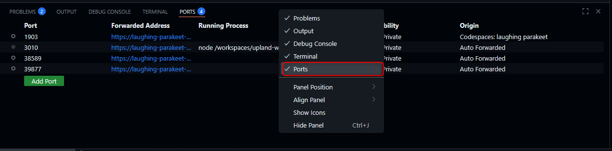
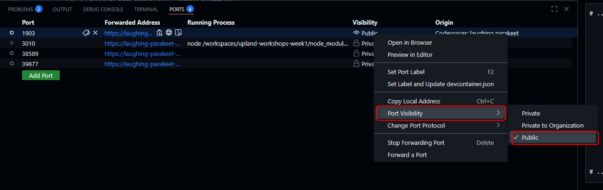
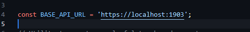
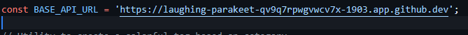
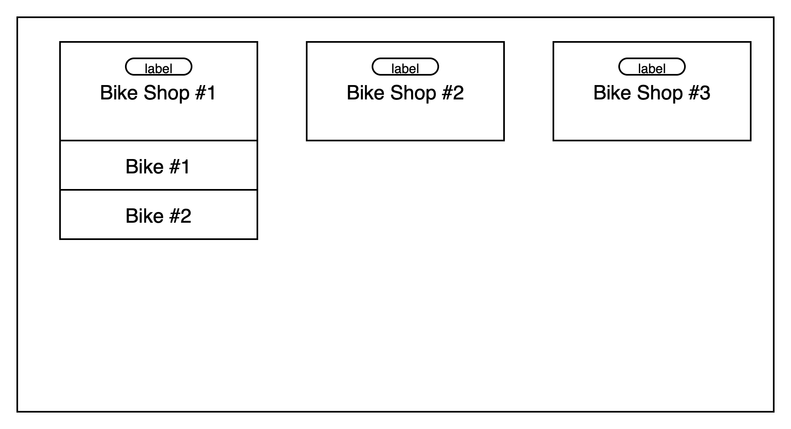

# Lab 6.1 App Generation: Building & Testing the Bikeshop Frontend App with Agent Mode

This tutorial demonstrates how to leverage GitHub Copilot’s prompt-based workflows to scaffold, implement, and test a simple web application. You’ll learn how to use Copilot for project setup, frontend development, and automated testing, using clear, goal-oriented prompts.

---

## Time Required

- 30–45 minutes

## Goals

- Use GitHub Copilot to scaffold a web app project.
- Generate HTML, CSS, and JavaScript with Copilot Agent mode.
- Set up local hosting and Playwright E2E tests using prompt-driven workflows.

---

### Step 0: Ask Copilot About the .NET Application and Client App Creation

Before starting, you can use Copilot in the Ask mode to understand the backend and how to connect a frontend client:

```text
@workspace Explain what the .NET application in `src/BikeShopAPI` does and what endpoints it exposes. How can I create a simple client app (e.g., in JavaScript) to interact with it?
```

Copilot will summarize the backend and suggest how to build a client app that communicates with the API.

---

### Step 1: Project Setup and Basic HTML Template

- Open GitHub Copilot in the **Agent** mode and click the **+** button to clear the prompt history.
- Type the following in the chat window:

  ```text
  Create a new directory called `bikeshop-app` under `src`.
  Create a basic HTML template for the bikeshop app with a header, footer, and empty main content area.
  ```

---

### Step 2: Implementing JavaScript Functionality

- Consider the JavaScript functionality needed to fetch and display bikeshops.
  To provide context for the prompt, use the Controller implementation. Imagine a scenario where you only want to consume the external API and have access to the Swagger documentation.

- Run the backend app and test the new functionality.

  ```sh
  cd src/BikeShopAPI
  dotnet run
  ```

- To make sure our frontend is able to connect to the API, we need to make the `1903` port `public`.

  - Go to `Ports` and locate port `1903`
  - If you can't see the `Ports` tab, right click on the panel - right next to `terminal` - and make sure the `Port` option is checked.
    
  - To change the visibility, right click on the `Private` then `Port Visibility -> Public`
    

- Open the link pointing to your application, you will see it in the terminal, probably `http://localhost:1903`. Open this link.
- It will redirect you to `https://your-codespaces-name-1903.app.github.dev`.
  - For example `https://fuzzy-robot-96q97vjpw5rfpq9p-1903.app.github.dev`.
- In your browser, in the address bar, to the end of the link add `/swagger/v1/swagger.json` and press Enter.
  - For example `https://fuzzy-robot-96q97vjpw5rfpq9p-1903.app.github.dev/swagger/v1/swagger.json`.
- You should see json file on the screen.
- Copy and paste the content into a new file, save the file under `swagger.json` in the `bikeshop-app` directory and use it as a reference for your prompt.
- Open previously generated HTML file.
- In Copilot Chat in the **Agent** mode, type:

  ```text
  In `app.js`, fetch bikeshops from the API on page load. Display bikeshops as a list with name, description, and a category tag. 
  - Use `${BASE_API_URL}/api/bikeshops` URL get default port from #file:launchSettings.json    #file:swagger.json   
  - On click, show bikes for the selected shop.
  - Integrate script with the existing HTML file.
  - Don't put any inline styling on this point, but prepare valid class names for the template.
  ```

> Take note that after copying the prompt above, #file will not properly add the file to the context. You will need to erase that and write it again by typing **#launchSettings.json** and **#swagger.json**

- Keep the `app.js` file, if Copilot also gives you a `.css` file, you can discard it.

- In `app.js`, you’ll find a line defining `BASE_API_URL`, which may look like this:
  
- To ensure your frontend connects to the API exposed by Codespaces, update this URL to use your Codespaces-specific address. It's the same address from which you copied the swagger file. For example:
  

  ```text
  const BASE_API_URL = 'https://[CODESPACE_NAME]-1903.app.github.dev';
  ```

---

### Step 3: Styling with CSS

- In Copilot Chat in the **Agent** mode, type:

  ```text
  Create a CSS file using a light blue, white, and black color scheme. Style the bikeshop list and bike details. Tag with category of the Bike SHop should have unique colour.
  ```

- (optionally) Attach a sketch with the layout plan, e.g.: 
  > Right-click the image, select `Copy Image`, and then paste it into the prompt box.

---

### Step 4: Local Hosting Setup

- Initialize your project and install the required package:

  ```sh
  cd src/bikeshop-app
  npm init -y
  npm install --save-dev serve
  ```

- Open the `package.json` file.

- In Copilot Chat in type:
  
  ```text
  Add an npm script to start the app locally on port 3010 using serve.
  ```

- Start your frontend app locally:

  ```sh
  npm start
  ```

---

### Step 5: Playwright E2E Test Setup

To begin working with Playwright for end-to-end testing, we need to install the required packages and set up the environment. This step ensures that your project has all the tools needed to run Playwright tests smoothly across different browsers.

- Run:

  ```sh
  npm install
  npm install -D @playwright/test
  npx playwright install
  npx playwright install-deps                 ║
  ```

- In Copilot Chat, type:

  ```text
  Create a Playwright config file in a `bikeshop-app` supporting Chromium in headless. Add tests for header visibility, bikeshop list rendering, and bike detail display on click.
  ```

  ```text
  Add an npm script to run Playwright tests. Use the app URL from package.json.
  Run Playwright tests in terminal.
  ```

---

### Step 6: Update CI/CD Pipeline to Handle the Generated JS App

After building your frontend app, ensure your CI/CD pipeline is set up to build, test, and deploy both the .NET backend and the generated JavaScript frontend.

- In Copilot Chat, type:

  ```text
  @workspace suggest how to modify my CI/CD workflow (e.g., GitHub Actions, Azure Pipelines) to build and deploy both the .NET API and the JavaScript app in `src/bikeshop-app`.
  ```

Copilot can generate a sample workflow that installs Node.js dependencies, runs frontend tests, builds the app, and deploys both backend and frontend artifacts.

---

### Optional: Deploying to Azure

For production, you can deploy both your .NET backend and JavaScript frontend to Azure.

- In Copilot Chat, type:

  ```text
  How can I deploy my .NET API and the JavaScript app in `src/bikeshop-app` to Azure (e.g., using Azure App Service or Azure Static Web Apps)?
  ```

Copilot can provide step-by-step deployment instructions or generate an Azure deployment workflow for your project.

---

## References

- Prompts and requirements are based on:
  - `create-app-prompt.md`
  - `tests-prompt.md`

---

Use these prompt/response pairs as templates for your own Copilot-driven development workflow!
